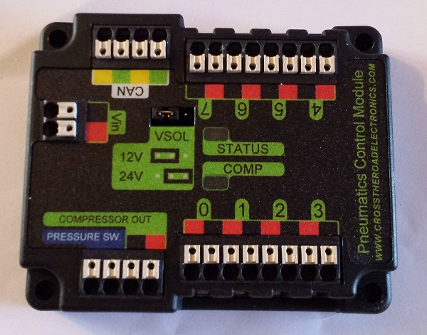
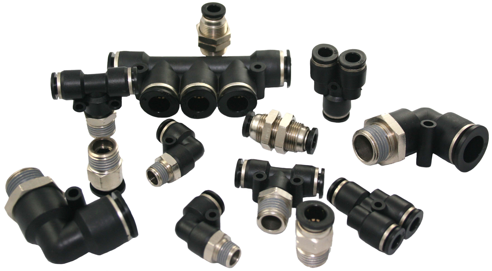

# pneumatics

"the branch of physics or technology concerned with the mechanical properties of gases"

## pneumatics in an FRC robot

The pneumatic system starts with a compressor. The compressor compresses air up to 120 psi. The pressure switch and pressure relief valve ensure the system doesn’t exceed 120 psi for safety reasons. The air is stored in air tanks. Gauges are used to monitor air pressure at various points in the pneumatic system. The regulator is used to regulate the air pressure to an FRC legal pressure of 60psi. A manifold is used to efficiently distribute air to the solenoids. Solenoids control the direction of airflow by allowing or blocking airflow in certain directions. Solenoids enable us to control pneumatic actuators. The PCM (pneumatic control module) allows us to control the solenoid and compressor.

## components
components you'll find in the pneumatic system 

* compressor
* solenoids
* storage tanks
* gauge
* digital gauge
* regulator
* manifold
* fittings
* pressure relief valve
* pressure switch
* pcm
* actuators

## pcm

The pneumatic control module is our interface between the air and electrical system. The pcm contains several relays to direct power to the compressor and solenoids which in turn cotrol air flow. The pcm communicates with the roborio over the can bus. The pcm is powered through a special port on the pdp. The pcm can accomodate 12V or 24V solenoids (selectable via the VSOL jumper).

## types of fittings

There are several types of fittings for the pneumatic system. 

## relevant pages

* [choosing actuators](choosing-actuators.md)